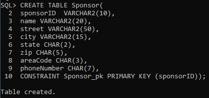

# Pleasantville-SQL-creation-&-queries

**Chapter 5 – Team Project: Creating and Manipulating a Relational Database for Team Project** 

Read the sample project steps for this chapter and apply the same techniques to the team project that you are developing. For the relational schema you developed at the end of Chapter 4 for the team project, carry out the following steps to implement the design using Oracle:

**Step 5.1 – Review and update the data dictionary and list of assumptions (as needed).** 

For each table, write the table name and write out the names, data types, and sizes of all the data items, and identify any constraints, using the conventions of the DBMS you will use for implementation.

No changes were made to the list of assumptions.

**TABLE Member**

memberId		VARCHAR	10	PRIMARY KEY

dateJoined		DATE		

lastName		VARCHAR2	20	NOT NULL

firstName		VARCHAR2	15	NOT NULL

street			VARCHAR2	50

city 			VARCHAR2	15 	 

state 			CHAR		2

zip                            	CHAR           	5 

areaCode 		CHAR		3 

phoneNumber 	CHAR		7 

currentOfficeHeld	VARCHAR2	50	

**TABLE DuesPayment**

duesYear		NUMBER	4	(duesYear,memberId )PRIMARY KEY	

memberId		VARCHAR	10	(duesYear,memberId) PRIMARY KEY

amount		NUMBER	3	NOT NULL 

datePaid		DATE	NOT NULL

**Table Play**

title  		VARCHAR2    		20         	PRIMARY KEY

author 		VARCHAR2   		20

numberOfActs   NUMBER 		2 

setChanges        NUMBER 		2

**TABLE Production**

year 		    NUMBER	4	(year, seasonStartDate) PRIMARY KEY

seasonStartDate DATE 		(year, seasonStartDate) PRIMARY KEY

seasonEndDate   DATE

title 		    VARCHAR2  	20	FOREIGN KEY

**TABLE MemberProduction**   

memberID		VARCHAR	10    	(memberId, year, seasonStartDate)* PRIMARY KEY 

year			NUMBER	4	(memberId, year, seasonStartDate)* PRIMARY KEY

seasonStartDate 	DATE 			 (memberId, year, seasonStartDate)* PRIMARY KEY

role  			VARCHAR2  	15

task   			VARCHAR2 	15

**TABLE Performance** 

perfDate 		DATE      		(perfDate, year) PRIMARY KEY

year 			NUMBER	4      	(perfDate, year) PRIMARY KEY

time 			CHAR 		5	/\* "hh:mm" \*/  

seasonStartDate     	DATE  	           		 FOREIGN KEY

**TABLE Subscriber**			

subID			VARCHAR2	10	PRIMARY KEY

firstName		VARCHAR2	15	

lastName		VARCHAR2	20	

street			VARCHAR2	50	

city			VARCHAR2	15	

state			CHAR		2	

zip			CHAR		5	

areaCode		CHAR		3	

phoneNumber		CHAR		7	

**TABLE TicketSale**			

saleID			VARCHAR2	10	PRIMARY KEY

saleDate		DATE		

totalAmount		NUMBER	7,2	

perfDate		DATE			(perfDate, perfYear) FOREIGN KEY

perfYear		NUMBER	4	(perfDate, perfYear) FOREIGN KEY

subID			VARCHAR2	10	FOREIGN KEY

**TABLE Ticket**

saleID 		VARCHAR2       10  	(saleID, seatLocation) PRIMARY KEY

seatLocation    VARCHAR2 	10 	(saleID, seatLocation) PRIMARY KEY

price  		Number 	(8,2)

type  		VARCHAR2 	10

**TABLE Sponsor**			

sponsorID 		VARCHAR2	10	PRIMARY KEY

name			VARCHAR2	20	

street			VARCHAR2	50	

city			VARCHAR2	15	

state			CHAR		2	

zip			CHAR		5	

areaCode		CHAR		3	

phoneNumber		CHAR		7	

**TABLE Donation**			

sponsorID		VARCHAR2	10	(sponsorID, donationDate) PRIMARY KEY

donationDate		DATE			(sponsorID, donationDate) PRIMARY KEY

donationType		VARCHAR2	20	

donationValue		NUMBER	7,2	

year			NUMBER	4	(year, seasonStartDate) FOREIGN KEY

seasonStartDate	DATE			(year, seasonStartDate) FOREIGN KEY

**Step 5.2 – Design SQL statements to create all tables needed to implement the design. Then create the tables in the database.** Show your work by providing screenshots of executing the CREATE TABLE SQL statements in the database.

CREATE TABLE MEMBER( 

memberId 		 VARCHAR(10)		NOT NULL,

dateJoined		 DATE,

lastName		 VARCHAR2(20)	NOT NULL,

firstName		 VARCHAR2(15)	NOT NULL,

street			 VARCHAR2(50),

city 			 VARCHAR2(15), 	 

state 			 CHAR(2),

zip                       	CHAR(5), 

areaCode 		CHAR(3), 

phoneNumber 	CHAR(7), 

currentOfficeHeld	VARCHAR2(50),

CONSTRAINT MEMBER\_pk PRIMARY KEY (memberId));

CREATE TABLE DUESPAYMENT(

duesYear	 NUMBER(4)	 NOT NULL,	

memberId	 VARCHAR(10)	 NOT NULL,

amount	NUMBER(3) 	NOT NULL, 

datePaid	 DATE		NOT NULL,

CONSTRAINT DUESPAYMENT\_pk PRIMARY KEY (duesYear,memberId),

CONSTRAINT DUESPAYMENT\_member\_id\_fk FOREIGN KEY(memberId) REFERENCES MEMBER (memberId) ON DELETE CASCADE);

CREATE TABLE PLAY(

title  		 	VARCHAR2(20) 	NOT NULL,

author 	 	 	VARCHAR2(20),

numberOfActs     	NUMBER(2), 

setChanges       	NUMBER(2),

CONSTRAINT PLAY\_pk PRIMARY KEY (title));

CREATE TABLE PRODUCTION(

year	                 NUMBER(4),

seasonStartDate DATE,

seasonEndDate   DATE 	NOT NULL,

title 		    VARCHAR2(20),

CONSTRAINT PRODUCTION\_pk PRIMARY KEY (year, seasonStartDate),

CONSTRAINT PRODUCTION\_title\_fk FOREIGN KEY(title) REFERENCES PLAY (title) ON DELETE CASCADE);

CREATE TABLE MemberProduction(

memberID		VARCHAR(10)		NOT NULL,

year			NUMBER(4)		NOT NULL,	

seasonStartDate	DATE			NOT NULL,

role			VARCHAR2(15)	NOT NULL,

task			VARCHAR2(15)	NOT NULL,

CONSTRAINT MemberProduction\_pk PRIMARY KEY (memberId, year, seasonStartDate),

CONSTRAINT MemberProduction\_memberid\_fk FOREIGN KEY (memberId) REFERENCES MEMBER (memberId) ON DELETE CASCADE,

CONSTRAINT MemberProduction\_year\_season\_start\_fk FOREIGN KEY(year, seasonStartDate) REFERENCES PRODUCTION (year, seasonStartDate) ON DELETE CASCADE);

CREATE TABLE Performance(

perfDate	 	DATE,

year 			NUMBER(4),

time 			CHAR(5),	

seasonStartDate 	DATE,

CONSTRAINT Performance\_pk PRIMARY KEY (perfDate, year),

CONSTRAINT Performance\_year\_season\_start\_fk FOREIGN KEY(year, seasonStartDate) REFERENCES PRODUCTION (year, seasonStartDate) ON DELETE CASCADE);

CREATE TABLE Subscriber(			

subID		 VARCHAR2(10),

firstName	 VARCHAR2(15),	

lastName	 VARCHAR2(20),	

street		 VARCHAR2(50),	

city		 VARCHAR2(15),	

state		 CHAR(2),	

zip		 CHAR(5),	

areaCode	 CHAR(3),	

phoneNumber	 CHAR(7),

CONSTRAINT Subscriber\_pk PRIMARY KEY (subID));

CREATE TABLE TicketSale(			

saleID		 VARCHAR2(10),

saleDate	 DATE,

totalAmount	 NUMBER(7,2),	

perfDate	 DATE,			

perfYear	 NUMBER(4),

subID		 VARCHAR2(10),

CONSTRAINT TicketSale\_pk PRIMARY KEY (saleID),

CONSTRAINT TicketSale\_perfYear\_fk FOREIGN KEY(perfDate, perfYear) REFERENCES Performance (perfDate, year) ON DELETE CASCADE,

CONSTRAINT TicketSale\_subID\_fk FOREIGN KEY(subID) REFERENCES Subscriber (subID) ON DELETE CASCADE);

CREATE TABLE Ticket(

saleID 			VARCHAR2(10),

seatLocation    	VARCHAR2(10), 

price  			Number(8,2),

type  			VARCHAR2(10),

CONSTRAINT Ticket\_pk PRIMARY KEY (saleID, seatLocation));

CREATE TABLE Sponsor(		

sponsorID 	 	VARCHAR2(10),

name		 	VARCHAR2(20),	

street			 VARCHAR2(50),	

city		 	VARCHAR2(15),	

state		 	CHAR(2),	

zip		 	CHAR(5),	

areaCode	 	CHAR(3),	

phoneNumber	 	CHAR(7),

CONSTRAINT Sponsor\_pk PRIMARY KEY (sponsorID));

CREATE TABLE Donation(			

sponsorID	 	VARCHAR2(10),	

donationDate	 	DATE,

donationType	 	VARCHAR2(20),	

donationValue	 	NUMBER(7,2),	

year			 NUMBER(4),	

seasonStartDate	 DATE,	

CONSTRAINT Donation\_pk PRIMARY KEY (sponsorID, donationDate),

CONSTRAINT Donation\_year\_season\_start\_fk FOREIGN KEY (year, seasonStartDate) REFERENCES PRODUCTION (year, seasonStartDate) ON DELETE CASCADE);

**Step 5.3 – Design SQL statements to create indexes for foreign keys and for any other columns that will be used most often for queries. Then execute the SQL statements in the database.** Show your work by providing screenshots of executing the SQL statements in the database.

create index memberid\_duespymt

`	`on DUESPAYMENT (memberId);

create index production\_n1

`	`on PRODUCTION (title);

create index production\_memberid

`	`on MEMBERPRODUCTION (memberId);

create index production\_start

`	`on MEMBERPRODUCTION (year, seasonStartDate);

create index performance\_start

`	`on PERFORMANCE (year, seasonStartDate);

create index ticketsale\_perfdate

`	`on TICKETSALE (perfDate, perfYear);

create index ticketsale\_subid

`	`on TICKETSALE (subID);

create index donation\_start

`	`on DONATION (year, seasonStartDate);

**Step 5.4 – Design SQL statements to insert at least five records in each table, preserving all constraints.** **Then insert the records into the tables.** Show your work by providing screenshots of executing the INSERT SQL statements in the database. 

INSERT INTO Member VALUES(‘1111111111’, ’01-Jan-2000’, ‘Jonson’, ‘Jon’,  ‘’, ‘’, ‘’ , ‘’, ‘’, ‘’, ‘’);

INSERT INTO Member VALUES(‘2222222222’, ’01-Feb-2002’, ‘Jonson’, ‘Ivan’,  ‘’, ‘’, ‘’ , ‘’, ‘’, ‘’, ‘’);

INSERT INTO Member VALUES(‘3333333333’, ’01-Apr-2004', ‘Jonson’, ‘Bob’,  ‘’, ‘’, ‘’ , ‘’, ‘’, ‘’, ‘’);

INSERT INTO Member VALUES(‘4444444444’, ’01-Jun-2010', ‘Jonson’, ‘Kat’,  ‘’, ‘’, ‘’ , ‘’, ‘’, ‘’, ‘’);

INSERT INTO Member VALUES(‘5555555555’, ’01-Oct-2011’, ‘Jonson’, ‘Andry’,  ‘’, ‘’, ‘’ , ‘’, ‘’, ‘’, ‘’);

INSERT INTO DUESPAYMENT VALUES(2021, ‘1111111111’, 100, ’01-Jan-2021’);

INSERT INTO DUESPAYMENT VALUES(2021, ‘2222222222’, 100, ’01-Jan-2021’);

INSERT INTO DUESPAYMENT VALUES(2021, ‘3333333333’, 100, ’01-Jan-2021’);

INSERT INTO DUESPAYMENT VALUES(2021, ‘4444444444’, 100, ’01-Jan-2021’);

INSERT INTO DUESPAYMENT VALUES(2021, ‘5555555555’, 100, ’01-Jan-2021’);

INSERT INTO Play VALUES(‘good story’, ‘Ivan Ivanov’, 01, 01);

INSERT INTO Play VALUES(‘very good story’, ‘Fedor Ivanov’, 02, 01);

INSERT INTO Play VALUES(‘sad story’, ‘Ivan Fedorov’, 01, 01);

INSERT INTO Play VALUES(‘just story’, ‘Victor Gold’, 02, 01);

INSERT INTO Play VALUES(‘Funny story’, ‘Jon Smith’, 01, 01);

INSERT INTO Production VALUES(2010, ’01-Jan-2010’, ’01-May-2010’, ‘good story’);

INSERT INTO Production VALUES(2011, ’01-Jan-2011’, ’01-May-2011’, ‘very good story’);

INSERT INTO Production VALUES(2012, ’01-Jan-2012’, ’01-May-2012’, ‘sad story’);

INSERT INTO Production VALUES(2013, ’01-Jan-2013’, ’01-May-2013’, ‘just story’);

INSERT INTO Production VALUES(2014, ’01-Jan-2014’, ’01-May-2014’, ‘Funny story’);

INSERT INTO MemberProduction VALUES(‘1111111111’, 2010, ’01-Jan-2010’, ‘dresser’, ‘pick up costume’);

INSERT INTO MemberProduction VALUES(‘2222222222’, 2011, ’01-Jan-2011’, ‘dresser’, ‘pick up costume’);

INSERT INTO MemberProduction VALUES(‘3333333333’, 2012, ’01-Jan-2012’, ‘dresser’, ‘pick up costume’);

INSERT INTO MemberProduction VALUES(‘4444444444’, 2013, ’01-Jan-2013’, ‘dresser’, ‘pick up costume’);

INSERT INTO MemberProduction VALUES(‘5555555555’, 2014, ’01-Jan-2014’, ‘dresser’, ‘pick up costume’);

INSERT INTO Performance VALUES(’01-Feb-2010’, 2010, ‘06:00’, ’01-Jan-2010’);

INSERT INTO Performance VALUES(’07-Feb-2010’, 2010, ‘06:00’, ’01-Jan-2010’);

INSERT INTO Performance VALUES(’14-Feb-2010’, 2010, ‘06:00’, ’01-Jan-2010’);

INSERT INTO Performance VALUES(’21-Feb-2010’, 2010, ‘06:00’, ’01-Jan-2010’);

INSERT INTO Performance VALUES(’28-Feb-2010’, 2010, ‘06:00’, ’01-Jan-2010’);

INSERT INTO Subscriber VALUES(‘1922929814’, ‘Fernando’,  'Juarez’, ‘69 Park Place’, ‘New York City’, ‘NY’, ‘19322’, ‘516’, ‘2143201’);

INSERT INTO Subscriber VALUES(‘0395322294’, ‘Yonny’, ‘Yonson’, ‘19 Manor Rd.’, ‘New York City’, ‘NY’, ‘10291’, ‘718’, ‘2451920’);

INSERT INTO Subscriber VALUES(‘5992819190’, ‘Cole’, ‘Trayn’, ‘42 Porque Place’, ‘New York City’, ‘NY’, ‘13932’, ‘315’, ‘4919104’);

INSERT INTO Subscriber VALUES(‘6195921325’, ‘Sam’, ‘Ayeam’, ‘939 Bazaar Rd’,  ‘New York City’, ‘NY’, ‘19282’, ‘347’, ‘2934935’);

INSERT INTO Subscriber VALUES(‘1843823471’, ‘Isgona’, ‘Dai’,  ‘119 Strait Ave.’, ‘New York City’, ‘NY’, ‘10541’, ‘347’, ‘5399349’);

INSERT INTO TicketSale VALUES(‘0000000001’, ’01-Feb-2010’, 20.00 ,’07-Feb-2010’, 2010, ‘0395322294’);

INSERT INTO TicketSale VALUES(‘0000000002’, ’01-Feb-2010’, 16.00,’07-Feb-2010’, 2010, ‘1922929814’);

INSERT INTO TicketSale VALUES(‘0000000003’, ’01-Feb-2010’, 14.00,’07-Feb-2010’, 2010, ‘5992819190’);

INSERT INTO TicketSale VALUES(‘0000000004’, ’01-Feb-2010’, 16.00,’07-Feb-2010’, 2010, ‘6195921325’);

INSERT INTO TicketSale VALUES( ‘0000000005’, ’01-Feb-2010’, 20.00,’07-Feb-2010’, 2010, ‘1843823471’);

INSERT INTO Ticket VALUES(‘0000000001’, ‘R-1 S-12’, 20.00, ‘’ ); 

INSERT INTO Ticket VALUES(‘0000000002’, ‘R-5 S-4’,  16.00,  ‘’);

INSERT INTO Ticket VALUES(‘0000000003’, 'R-10 S-1’, 14.00,  ‘’); 

INSERT INTO Ticket VALUES(‘0000000004’, 'R-6 S-7', 16.00,  ‘’); 

INSERT INTO Ticket VALUES(‘0000000005’, 'R-3 S-5', 20.00,  ‘’); 

INSERT INTO Sponsor VALUES(‘9248192533’, ‘Mac Afi’, ‘123 Lowe St.’, ‘New York City’, ‘NY’, ‘13934’, ‘212’, ‘3429575’); 

INSERT INTO Sponsor VALUES(‘3955945319’, ‘Sheena Karra’, ‘83 LoveLace Ave.’, ‘New York City’, ‘NY’, ‘24933’, ‘718’, ‘2921943’);

INSERT INTO Sponsor VALUES(‘1994793320’, ‘Tom Bamadil’, ‘523 Gineve Place’, ‘New York City’, ‘NY’, ‘12839’, ‘347’, ‘1092042’);

INSERT INTO Sponsor VALUES(‘1837438312’, ‘Barry Kimble’, ‘184 36th St.’,  ‘New York City’, ‘NY’, ‘10412’, ‘212’, ‘9312920’);

INSERT INTO Sponsor VALUES(‘5211902212’, ‘Zoe Springfield’, ‘46 10th St.’,  ‘New York City’, ‘NY’, ‘19931’, ‘212’, ‘3241492’);

INSERT INTO Donation VALUES(‘9248192533’, ‘22-Jul-2009’, ‘Cash’, 500.00,  2010, ’01-Jan-2010’);

INSERT INTO Donation VALUES(‘3955945319’, ‘1-Dec-2009’, ‘Cash’, 850.00, 2010, ’01-Jan-2010’);

INSERT INTO Donation VALUES(‘1837438312’, ‘1-Jul-2009’,  ‘Cash’, 1000.00, 2010, ’01-Jan-2010’);

INSERT INTO Donation VALUES(‘1994793320’, ‘13-Jun-2009’, ‘Cash’, 600.00, 2010, ’01-Jan-2010’);

INSERT INTO Donation VALUES(‘5211902212’, ‘1-Feb-2009’, ‘Cash’, 650.00, 2010, ’01-Jan-2010’);

**Step 5.5 – Design SQL statements that will process five non-routine requests for information from the database. Then execute the SQL statements in the database.** Show your work by providing screenshots of executing the SQL statements in the database along with the results.

**Find Sponsors with the area code 212.**

SELECT \*

FROM Sponsor

WHERE Sponsor.areaCode = ‘212’;

**Find the saleIDs and seatLocations of tickets that cost less than 20.00.**

SELECT saleId, seatLocation

FROM Ticket 

WHERE price < 20.00;

**Find the names of sponsors who donated more than 600.00.**

select S.name, sum(D.donationValue)

FROM Donation D, Sponsor S

where S.sponsorId = D.sponsorId

group by S.name

having sum(donationValue)>600;

**Find the productions that were shown before 2014.**

SELECT \*

FROM Production

WHERE Production.year < 2014;

**Find the play associated with the author Ivan Ivanov.**

SELECT \*

FROM Play

WHERE Play.author = ‘Ivan Ivanov’;

**Step 5.6 – Design one trigger for your project. Then create the trigger in the database.** Show your work by providing screenshots of creating the trigger in the database.

CREATE or REPLACE TRIGGER member\_t1

BEFORE INSERT OR UPDATE on member

REFERENCING NEW AS NEW OLD AS OLD

for EACH ROW

BEGIN :NEW.WHO\_UPDATED := USER;

`        		`:NEW.WHEN\_UPDATED := SYSDATE;

`      `END;

/

**Step 5.7 – Design and execute SQL statements to demonstrate that the trigger is working as expected.** To demonstrate that the trigger is working as expected, provide a screenshot of the data before and after the trigger is executed.

insert into member (memberId, dateJoined, lastName, firstName, street, city, state, zip, areaCode, phoneNumber, currentOfficeHeld)

VALUES (‘6666666666’, ’01-Jun-2022', ‘Luthor’, ‘Lex’,  ‘Wayne Ave’, ‘West Nyack’, ‘NY’ , ‘10956’, ‘914’, ‘7398290’, ‘President’);

